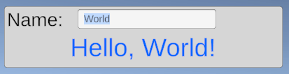

[](https://github.com/nadako/TinkStateSharp/actions/workflows/build.yml)
[](https://codecov.io/gh/nadako/TinkStateSharp)

# TinkState# - Reactive State Handling for C# (and Unity!)

An uncomplicated library for dealing with mutable state in a nice reactive way.

[Documentation](https://nadako.github.io/TinkStateSharp/).

Features:
 - Lightweight and generic observable state primitives
 - Efficient binding mechanism with support for per-frame batching
 - Computed states with automatic update propagation
 - Asynchronously computed states with async/await
 - Out-of-the-box support for Unity with convenience helpers

## Quick Peek

Here's a "hello world" teaser in Unity (source code below).



<details>
<summary>Source Code</summary>

```cs
using TinkState;
using TMPro;
using UnityEngine;

public class HelloWorld : MonoBehaviour
{
	[SerializeField] TMP_InputField nameInput;
	[SerializeField] TMP_Text greetingLabel;

	void Start()
	{
		// define piece of mutable observable state
		var name = Observable.State("World");

		// bind the state two-ways to an input field
		name.Bind(nameInput.SetTextWithoutNotify);
		nameInput.onValueChanged.AddListener(newValue => name.Value = newValue);

		// derive automatically updated observable value from it
		var greeting = Observable.Auto(() => $"Hello, {name.Value}!");

		// bind the auto-observable to a text field
		greeting.Bind(text => greetingLabel.text = text);
	}
}
```
</details>

## Status

**BETA**. Everything seems to be working and test coverage makes sure of it, but the code could use some polishing, naming review, performance audit. See also TODOs in the code.

## Thanks

It is a C# port of an excellent [Haxe](https://haxe.org/) library [tink_state](https://github.com/haxetink/tink_state) by Juraj Kirchheim ([@back2dos](https://github.com/back2dos)).

## [Unlicense](https://unlicense.org/)

This is free and unencumbered software released into the public domain.
